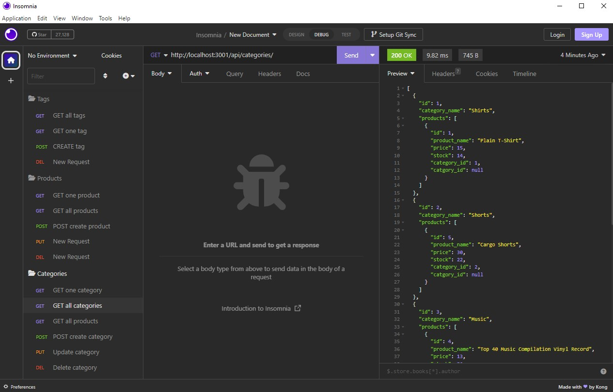

# 13-e-commerce

## Description

This is an e-commerce website.

Please find view [this link](https://drive.google.com/file/d/1PvvE4CADa8KUwcnDqVNKOM4mkXFfaPgM/view) to preview how the application functions.

## Table of Contents

- [Installation](#installation)

- [Usage](#usage)

- [Contributing](#contributing)

- [Questions](#questions)

## Installation

1. Go to root directory
2. npm init -y
3. Type `npm i inquirer@8.2.4` in the terminal (install node modules)
4. Type `npm install --save mysql2` [Reference docs](https://www.npmjs.com/package/mysql2)
5. Type `npm install --save dotenv`
6. Type `npm install -- save express`
7. Type `npm install -- save sequelize`
8. Open the mysql shell using `mysql -u root -p` (enter your password when prompted)
9. Within mysql shell, type `source db/schema.sql`
10. Within mysql shell, type `USE employee_db;`
11. Leave mysql shell by either typing `exit` or `Ctrl`+`c`
12. Back in the main bash terminal, type `npm run seeds` to seed the db
13. Type `node server.js` to begin the application

## Usage

This application is for the back end demonstrating the ability to view existing data, update that data, and add data. The demonstration of functionality is in insomnia.

## Contributing

[Katie Vlasic](https://github.com/katievlasic)

## Questions

Contact [me](https://github.com/katievlasic) with any questions!
